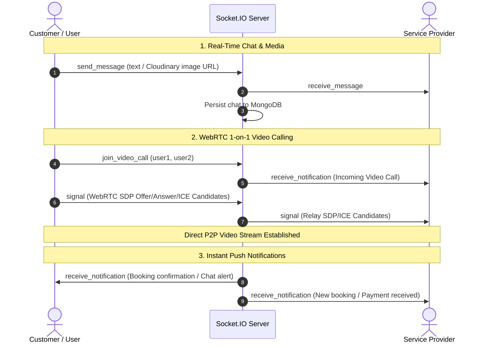

# ServEasy — Backend API 🚀

[](https://www.typescriptlang.org/)
[](https://nodejs.org/)
[](https://expressjs.com/)
[](https://www.mongodb.com/)
[](https://redis.io/)
[](https://socket.io/)
[](https://docs.bullmq.io/)
[](https://ai.google.dev/)
[](https://razorpay.com/)

**ServEasy** is an enterprise-grade, on-demand service marketplace backend built with **TypeScript**, **Node.js**, and **Express**, architected strictly according to **Clean Architecture** and **Domain-Driven Design (DDD)** principles.

The platform connects customers with verified service professionals for both offline services and online slot-based consultations, featuring real-time WebRTC video calling, instant messaging, an AI assistant powered by Google Gemini, automated background job queues, and secure Razorpay payment processing.

---

## 📑 Table of Contents

- [Architectural Overview](#-architectural-overview)
- [SOLID Principles in Practice](#-solid-principles-in-practice)
- [DTO Mapping & Data Sanitization](#-dto-mapping--data-sanitization)
- [Key Features by Role](#-key-features-by-role)
  - [Customer / User](#1-customer--user)
  - [Service Provider](#2-service-provider)
  - [Administrator](#3-administrator)
- [Core Technologies & Integrations](#-core-technologies--integrations)
- [Project Directory Structure](#-project-directory-structure)
- [Background Jobs & Asynchronous Processing](#-background-jobs--asynchronous-processing)
- [Real-Time Capabilities](#-real-time-capabilities)
- [API Overview & Route Endpoints](#-api-overview--route-endpoints)
- [Environment Variables Guide](#-environment-variables-guide)
- [Getting Started & Local Setup](#-getting-started--local-setup)
- [Docker Deployment](#-docker-deployment)
- [Engineering Highlights](#-engineering-highlights)

---

## 🏛 Architectural Overview

The backend is built around **Clean Architecture** (Ports & Adapters / Hexagonal Architecture) and **SOLID** principles, utilizing **TSyringe** for Dependency Injection and Inversion of Control (IoC).

```
   ┌─────────────────────────────────────────────────────────┐
   │                   Presentation Layer                    │
   │      (Express Routes, Controllers, Custom Middleware)   │
   └───────────────────────────┬─────────────────────────────┘
                               │
   ┌───────────────────────────▼─────────────────────────────┐
   │                   Application Layer                     │
   │      (Use Cases, DTOs, Business Logic, Socket Handlers) │
   └───────────────────────────┬─────────────────────────────┘
                               │
   ┌───────────────────────────▼─────────────────────────────┐
   │                     Domain Layer                        │
   │          (Entities, Value Objects, Repository Interfaces)│
   └───────────────────────────▲─────────────────────────────┘
                               │
   ┌───────────────────────────┴─────────────────────────────┐
   │                  Infrastructure Layer                   │
   │ (Mongoose Models, Repositories, Redis, BullMQ, Cron, SDKs)│
   └─────────────────────────────────────────────────────────┘
```

- **Domain Layer (`src/domain/`)**: Enterprise business entities and repository contracts. Completely decoupled from frameworks, databases, and third-party SDKs.
- **Application Layer (`src/application/`)**: Encapsulates specific application use cases, request/response DTOs, and orchestrates domain operations.
- **Infrastructure Layer (`src/infrastructure/`)**: Implements repository interfaces using MongoDB/Mongoose, configures Redis, BullMQ queue workers, and cron tasks.
- **Presentation Layer (`src/presentation/`)**: Express controllers, REST routes, JWT authentication, and role-based access control (RBAC) middleware.
- **Services Layer (`src/services/`)**: Adapter wrappers for external APIs (Gemini AI, Cloudinary, Razorpay, LocationIQ, Twilio, Nodemailer).

---

## 📐 SOLID Principles in Practice

The codebase is engineered with strict adherence to the **SOLID** software design principles:

### 1. Single Responsibility Principle (SRP)
Each class and module has one, and only one, reason to change:
- **Fine-Grained Use Cases**: Rather than bloated service classes, every distinct business operation has its own use case (e.g., `CreateBookingUseCase`, `CancelBookingUseCase`, `VerifyOtpUseCase`, `MakeCouponInactiveUseCase`, `UploadBillsUseCase`).
- **Dedicated External Adapters**: Specialized service classes (`RazorpayService`, `GoogleGenAIService`, `CloudinaryService`, `LocationService`, `MailService`, `SmsOtpService`) each handle a single third-party integration without leaking vendor logic into core business rules.
- **Modular Socket Event Handlers**: Real-time event handling is cleanly partitioned into `ChatHandler`, `NotificationHandler`, and `VideoCallHandler`.

### 2. Open/Closed Principle (OCP)
The system is open for extension but closed for modification:
- **Interface-Driven Services**: Business use cases depend on abstract contracts (`IEmailService`, `ISmsOtpService`, `ILocationService`, `ITokenService`).
- If the SMS provider changes from Twilio to another vendor, or the email provider changes from Nodemailer SMTP to AWS SES, a new class implementing the interface can be plugged in via `container.ts` without modifying existing use cases.

### 3. Liskov Substitution Principle (LSP)
Subtypes and concrete implementations are fully substitutable for their base abstractions:
- Concrete repository classes (`MongoUserRepository`, `CategoryRepository`, `ServiceBookingRepository`, `SlotRepository`) strictly fulfill domain contracts (`IUserRepository`, `ICategoryRepository`, `IServiceBookingRepository`, `ISlotRepository`).
- Application use cases interact solely through domain repository interfaces, ensuring any compliant persistence engine can be substituted without altering application behavior.

### 4. Interface Segregation Principle (ISP)
Clients are not forced to depend on interfaces they do not use:
- Interfaces are fine-grained and role-tailored (e.g., `ISlotRepository`, `ICouponRepository`, `IProviderWalletRepository`, `IAiAssistanceRepository`).
- Each use case defines a concise interface (e.g., `ICreateCouponUseCase`, `IGetWalletUseCase`, `IRescheduleOnlineServiceSlotUseCase`) exposing only the necessary `execute()` signature to its controller consumer.

### 5. Dependency Inversion Principle (DIP)
High-level policy modules do not depend on low-level detail modules; both depend on abstractions:
- Inversion of Control is managed via **TSyringe** with decoupled token constants (`REPOSITORY_TOKENS`, `SERVICE_TOKENS`, `USE_CASE_TOKENS`):
```typescript
@injectable()
export class CreateCouponUseCase implements ICreateCouponUseCase {
  constructor(
    @inject(REPOSITORY_TOKENS.CouponRepository)
    private readonly couponRepo: ICouponRepository
  ) {}

  async execute(coupon: CreateCouponDTO): Promise<CouponResponseDTO> {
    // Business logic decoupled from MongoDB/Mongoose
    const couponEntity: ICoupon = { ...coupon, usedBy: [], isActive: true };
    return await this.couponRepo.createCoupon(couponEntity);
  }
}
```

---

## 🔄 DTO Mapping & Data Sanitization

ServEasy implements strict **Data Transfer Object (DTO)** boundaries and data sanitization layers to guarantee type safety, prevent over-posting vulnerabilities, and protect sensitive domain data from being leaked to clients:

```
┌──────────────────────────┐
│    HTTP Request Body     │
└────────────┬─────────────┘
             │
             ▼
┌──────────────────────────┐
│       Request DTO        │  (e.g., CreateCouponDTO, AddServiceDTO, RegisterServiceProviderDTO)
└────────────┬─────────────┘
             │
             ▼  [Validation & Business Transformation in Use Case]
┌──────────────────────────┐
│      Domain Entity       │  (e.g., ICoupon, IService, IServiceProvider)
└────────────┬─────────────┘
             │
             ▼  [Persistence via Repository Contract]
┌──────────────────────────┐
│     Mongoose Schema      │  (MongoDB Document in Infrastructure Layer)
└────────────┬─────────────┘
             │
             ▼  [Data Fetching & Mapping]
┌──────────────────────────┐
│      Domain Entity       │  (e.g., IUser, IServiceProvider)
└────────────┬─────────────┘
             │
             ▼  [Sanitizers / DTO Projection]
┌──────────────────────────┐
│  Response DTO / SafeView │  (e.g., SafeUser, CouponResponseDTO, ProviderResponseDTO)
└────────────┬─────────────┘
             │
             ▼
┌──────────────────────────┐
│    HTTP Response JSON    │  (Clean, Safe & Free of Sensitive Fields)
└──────────────────────────┘
```

- **Request DTOs (`src/application/dtos/`)**: Define strict typing for incoming payloads, ensuring controllers and use cases only process expected fields (e.g., `CreateBookingDTO`, `AddCategoryDTO`, `SubscriptionPlanDTO`).
- **Response DTOs**: Structure outbound data shapes, transforming internal timestamps, nested IDs, and related entity structures for optimal client consumption.
- **Sanitization Helpers (`src/utils/sanitizers/`)**:
  - `userSanitizer`: Strips sensitive fields like password hashes, verification tokens, and internal security flags, mapping `IUser` into a `SafeUser` representation.
  - `serviceProviderSanitizer`: Normalizes provider profile fields and associated credentials for secure client-side consumption.

---

## 🌟 Key Features by Role

### 1. Customer / User
- **Flexible Authentication**:
  - Email + Password registration with 6-digit OTP verification via Nodemailer.
  - Mobile OTP authentication via Twilio SMS.
  - One-click Google OAuth2 sign-in (`google-auth-library`).
  - Forgot password & reset password workflows with OTP.
  - Secure JWT access (15 min) and refresh tokens (7 days) stored in HTTP-only cookies.
- **Service Discovery & Booking**:
  - Nearby service search powered by LocationIQ geocoding and live autocomplete suggestions.
  - In-person service booking with custom address selection.
  - Online service booking with interactive time-slot picker.
  - Real-time booking tracking: pending, confirmed, in-progress, completed, or cancelled.
  - Online slot rescheduling mechanism.
- **Billing & Coupons**:
  - Apply active and featured discount coupons to booking orders.
  - Secure checkout via Razorpay with cryptographic signature verification.
- **Engagement & Communication**:
  - 1-on-1 real-time chat with service providers (text & image sharing).
  - WebRTC Peer-to-Peer 1-on-1 video consultations.
  - Real-time push notifications and in-app notification center.
  - Post-service ratings and detailed reviews.

### 2. Service Provider
- **Onboarding & Verification**:
  - Multi-step registration submitting professional credentials and identity documents to Cloudinary.
  - Re-application flow if verification was rejected with admin feedback.
- **Service & Slot Management**:
  - Create and manage service catalog listings under approved admin categories.
  - Dynamic slot scheduler (create, view, delete slots for online sessions).
  - Mass activate/deactivate services.
- **Booking Fulfillment & Invoicing**:
  - Accept or reject incoming booking requests.
  - Upload digital service invoices/bills directly to Cloudinary.
  - Request post-service payment from customers.
- **Financials & Provider Wallet**:
  - Dedicated provider wallet tracking earnings and transaction history.
  - Direct payout/withdrawal requests.
  - Revenue analytics chart data.
- **Subscription Tier Model**:
  - Choose and purchase provider subscription plans via Razorpay.
  - Automated status updates and expiry enforcement.
- **AI Business Assistant**:
  - Built-in AI chat powered by Google Gemini 2.5 Flash (`@google/genai`) to assist with customer communications, service copywriting, and business tips.
- **Ad Promotion Platform**:
  - Create targeted in-app ad banners.
  - Rate-limited click tracking (`express-rate-limit`) to prevent click fraud.

### 3. Administrator
- **Platform Governance**:
  - Review provider verification applications (approve or reject with custom rejection reasons sent via automated email).
  - User and service provider management (view profiles, block/unblock accounts).
- **Catalog Management**:
  - Category and service management (create, edit, delete, block/unblock).
- **Revenue & Payout Operations**:
  - Platform-wide booking analytics and revenue dashboards.
  - Review and process provider wallet withdrawal requests.
- **Subscriptions & Marketing**:
  - Create and update provider subscription plans.
  - Create discount coupons and toggle banner feature highlights.
  - Review provider advertisements and toggle active statuses.
- **Content Management (CMS)**:
  - Configure dynamic site banners (home banners, footer banners) and frontend theme settings.

---

## 🛠 Core Technologies & Integrations

| Category | Technologies / Libraries |
| :--- | :--- |
| **Runtime & Language** | Node.js (v18+), TypeScript 5.8, Express 4.21 |
| **Database & ODM** | MongoDB, Mongoose 7 |
| **Caching & In-Memory Store** | Redis (`ioredis` 5.6) |
| **Dependency Injection** | `tsyringe` 4.8, `reflect-metadata` |
| **Queue & Scheduled Tasks** | `bullmq` 5.56, `node-cron` 4.2 |
| **Real-Time Communication** | `socket.io` 4.8 (WebSockets & WebRTC Signaling) |
| **Artificial Intelligence** | Google Gemini API (`@google/genai` with `gemini-2.5-flash`) |
| **Payment Gateway** | Razorpay SDK (`razorpay` 2.9) |
| **Cloud Storage** | Cloudinary SDK (`cloudinary` 2.5) |
| **Authentication & Security** | JWT (`jsonwebtoken`), `bcrypt`, `google-auth-library`, `cookie-parser`, `cors` |
| **Location & Maps** | LocationIQ REST API & Autocomplete via `axios` |
| **Communications (Email/SMS)** | Nodemailer (SMTP), Twilio REST SDK |
| **Logging & Utilities** | Morgan, `rotating-file-stream`, `express-rate-limit`, `uuid` |

---

## 📂 Project Directory Structure

```
src/
├── app.ts                                # Application entrypoint & HTTP server configuration
├── container.ts                          # TSyringe IoC container (DI bindings)
├── constants/
│   ├── HttpStatus.ts                     # Standardized HTTP status codes
│   └── tokens.ts                         # DI injection tokens (Repositories, Services, Use Cases)
├── domain/                               # Enterprise Domain Layer
│   ├── entities/                         # Domain entity interfaces (IUser, IServiceProvider, etc.)
│   └── repositories/                     # Domain repository interface contracts
├── application/                          # Application Business Logic Layer
│   ├── dtos/                             # Request and Response Data Transfer Objects
│   ├── handlers/                         # Socket.IO event handlers (Chat, Notifications, Video Call)
│   └── use-case/                         # Use case implementations grouped by domain
│       ├── admin/                        # Admin use cases (users, providers, coupons, site-settings)
│       ├── ads/                          # Ad lifecycle use cases
│       ├── common/                       # Shared use cases (payments, notifications, chat)
│       ├── serviceProvider/              # Provider use cases (auth, services, slots, AI, wallet)
│       └── user/                         # User use cases (auth, bookings, reviews, address)
├── infrastructure/                       # Infrastructure Layer
│   ├── database/                         # MongoDB connection logic
│   ├── jobs/                             # Background workers and schedulers
│   │   ├── BullConnection.ts             # Redis connection for BullMQ
│   │   ├── cron/                         # Schedulers (Ads expire, Slot cleanup, Subscriptions)
│   │   └── queue/                        # BullMQ delayed queue (Auto-cancel pending bookings)
│   ├── models/                           # Mongoose data models
│   └── repositories/                     # Concrete Mongoose repository implementations
├── presentation/                         # Presentation Layer
│   ├── controllers/                      # HTTP request handlers
│   ├── Middlewares/                      # Auth, RBAC, Rate limiting, Error handler
│   └── routes/                           # Express route definitions
├── services/                             # External Service Integrations
│   ├── aiAssistant/                      # Google Gemini AI service
│   ├── cloudinary/                       # Cloudinary asset upload service
│   ├── location/                         # LocationIQ geocoding & autocomplete service
│   ├── mailService/                      # Nodemailer SMTP email service
│   ├── otp/                              # OTP generation, Redis caching & Twilio SMS service
│   ├── payment/                          # Razorpay order generation & signature verification
│   ├── redis/                            # Redis client abstraction
│   ├── socket/                           # Socket.IO real-time manager
│   └── token/                            # JWT access/refresh token service
└── utils/                                # Helpers, logger, sanitizers, error utils
```

---

## ⏱ Background Jobs & Asynchronous Processing

ServEasy employs both distributed job queues and scheduled cron workers for reliable background automation:

1. **Auto-Cancel Expired Pending Bookings (`BullMQ`)**:
   - When a user submits a booking, an asynchronous job is dispatched to BullMQ with a 15-minute delay.
   - If the service provider does not accept the booking within 15 minutes, the worker automatically cancels the booking and updates the booking status.
2. **Subscription Expiry Monitor (`node-cron`)**:
   - Runs on a scheduled basis to verify provider subscription end dates, automatically updating expired subscriptions.
3. **Daily Ad Campaign Expiration (`node-cron`)**:
   - Executes daily at 12:00 PM to verify active advertisement durations and mark completed campaigns as expired.
4. **Daily Expired Slots Cleanup (`node-cron`)**:
   - Executes daily at 12:00 AM (`Asia/Kolkata` timezone) to purge past, unbooked online slots from the database.

---

## ⚡ Real-Time Capabilities

The platform implements **Socket.IO** to provide low-latency communication across multiple features:



---

## 🔌 API Overview & Route Endpoints

### 🔐 Authentication & Common Routes (`/`)
| Method | Endpoint | Description | Access |
| :--- | :--- | :--- | :--- |
| `POST` | `/signup` | User registration | Public |
| `POST` | `/signin/:method` | User login (email or phone) | Public |
| `POST` | `/google/signin` | Google OAuth2 sign-in | Public |
| `POST` | `/verify-otp` | Verify registration OTP | Public |
| `POST` | `/resend-otp` | Resend verification OTP | Public |
| `POST` | `/refresh-token` | Renew user access token | Public (Cookie) |
| `POST` | `/admin-refresh-token`| Renew admin access token | Public (Cookie) |
| `GET` | `/logout` | Clear user session cookies | User |

### 👤 User Endpoints (`/`)
| Method | Endpoint | Description | Access |
| :--- | :--- | :--- | :--- |
| `GET` | `/profile` | Get authenticated user profile | User |
| `PUT` | `/updateProfile/:userid` | Update user profile details | User |
| `POST` | `/forgot-password` | Send password reset OTP | Public |
| `POST` | `/forgot-password/verify-otp` | Verify password reset OTP | Public |
| `POST` | `/forgot-password/reset` | Reset account password | Public |
| `GET` | `/getactive/services/` | Get active nearby services | User |
| `GET/POST/PUT` | `/user/addresses` | Manage saved user addresses | User |
| `DELETE` | `/user/addresses:id` | Delete a saved address | User |
| `POST` | `/reviews` | Submit a review for a service | User |
| `GET` | `/notification` | Get user notifications | User |
| `PATCH` | `/notification/:id` | Mark notification as read | User |
| `GET` | `/coupons` | List active coupons | Public |
| `GET` | `/coupons/featured` | List featured banner coupons | Public |
| `PATCH` | `/ads/:adId/click` | Increment ad click count (Rate-limited) | Public |

### 🛠 Service Provider Endpoints (`/service-providers`)
| Method | Endpoint | Description | Access |
| :--- | :--- | :--- | :--- |
| `POST` | `/register` | Submit service provider application | User |
| `GET` | `/registration/details`| Get submitted registration details | User |
| `PUT` | `/reapply` | Re-apply after application rejection | User |
| `GET` | `/status` | Check provider approval status | User |
| `GET` | `/verify` | Validate provider credentials | User |
| `GET/PUT` | `/` | Get / update provider profile | Provider |
| `GET` | `/wallet` | View provider wallet & earnings | Provider |
| `POST` | `/wallet` | Request withdrawal from wallet | Provider |
| `GET` | `/subscription-plans` | View available subscription plans | Public |
| `POST` | `/ads` | Create a new promotion ad | Provider |
| `PUT` | `/ads/:adId` | Edit an existing ad | Provider |
| `GET` | `/ads/provider/:providerId` | Get ads for a provider | Provider |
| `POST` | `/ai-assistance/chats` | Prompt Google Gemini AI assistant | Provider |
| `GET` | `/ai-assistance/chats/:chatId` | Retrieve AI session chat history | Provider |

### 📅 Booking & Service Endpoints (`/service`)
| Method | Endpoint | Description | Access |
| :--- | :--- | :--- | :--- |
| `POST` | `/` | Add new service catalog listing | Provider |
| `GET` | `/` | List services created by provider | Provider |
| `PUT` | `/:serviceId` | Update service details | Provider |
| `PATCH` | `/block-unblock` | Toggle service active status | Provider |
| `POST` | `/book` | Create standard offline booking | User |
| `POST` | `/book-online` | Create online slot-based booking | User |
| `GET` | `/bookings` | List user booking history | User |
| `GET` | `/bookings/serviceprovider`| List provider bookings | Provider |
| `PATCH` | `/service-provider/booking/:id/confirm` | Accept booking | Provider |
| `PATCH` | `/service-provider/booking/:id/cancel` | Cancel booking | Provider |
| `PATCH` | `/service-provider/booking/:id/status` | Update booking status | Provider |
| `POST` | `/service-provider/uploadbills/:id` | Upload digital invoice | Provider |
| `POST` | `/service-provider/booking/:id/payment-request`| Request payment | Provider |
| `POST` | `/slots` | Create online consultation slots | Provider |
| `GET` | `/online-services/slots/:id` | Get slots for an online service | Public |
| `DELETE` | `/slots/:id` | Delete an online slot | Provider |
| `PATCH` | `/online-bookings/:bookingId/reschedule` | Reschedule appointment | User |
| `POST` | `/bookings/:bookingId/coupon/apply` | Apply coupon code to booking | User |
| `DELETE` | `/bookings/:bookingId/coupon/remove` | Remove applied coupon | User |

### 💳 Payment Endpoints (`/payment`)
| Method | Endpoint | Description | Access |
| :--- | :--- | :--- | :--- |
| `POST` | `/create-order` | Create Razorpay order for booking | User |
| `POST` | `/verify` | Verify Razorpay payment signature | User |
| `POST` | `/subscription/createOrder` | Create Razorpay subscription order | Provider |
| `POST` | `/subscription/verify` | Verify provider subscription payment | Provider |

### 🛡 Admin Endpoints (`/admin`)
| Method | Endpoint | Description | Access |
| :--- | :--- | :--- | :--- |
| `POST` | `/signin` | Admin authentication | Public |
| `GET` | `/profile` | Get admin profile | Admin |
| `GET` | `/users` | Get all registered users | Admin |
| `PATCH` | `/users/block-unblock` | Block or unblock a user | Admin |
| `GET` | `/serviceProvider` | Get all service providers | Admin |
| `GET` | `/serviceProvider/verification/:id` | View provider verification docs | Admin |
| `PATCH` | `/service-provider/verify` | Approve provider application | Admin |
| `PATCH` | `/serviceProvider/reject` | Reject provider application with reason | Admin |
| `GET/POST/PUT`| `/category` | Manage service categories | Admin |
| `DELETE` | `/category/:id` | Delete category | Admin |
| `GET` | `/dashboard/payment-info` | Platform revenue & chart metrics | Admin |
| `GET` | `/wallets` | List provider wallets | Admin |
| `PATCH` | `/wallets/:walletId` | Process wallet withdrawal | Admin |
| `GET/POST`| `/coupons` | Manage discount coupons | Admin |
| `GET/POST`| `/subscriptions` | Manage subscription tiers | Admin |
| `GET/POST/PUT`| `/site-settings/*` | Manage banners and themes | Admin |

### 💬 Chat & Media Endpoints (`/chat` & `/location`)
| Method | Endpoint | Description | Access |
| :--- | :--- | :--- | :--- |
| `POST` | `/chat/chats` | Fetch conversation messages | User / Provider |
| `POST` | `/chat/upload-image` | Upload chat attachment to Cloudinary | User / Provider |
| `GET` | `/location/autocomplete`| LocationIQ address autocomplete | Public |

---

## 🔑 Environment Variables Guide

Create a `.env` file in the root directory and configure the following variables:

```env
# --- Server Configuration ---
PORT=5001
NODE_ENV=development
CLIENT_URL=http://localhost:5173

# --- Database & Redis ---
MONGOURL=mongodb://localhost:27017/serveasy
REDIS_URL=redis://127.0.0.1:6379

# --- JWT Authentication ---
ACCESS_TOKEN_SECRET=your_jwt_access_secret_key
REFRESH_TOKEN_SECRET=your_jwt_refresh_secret_key

# --- Google OAuth2 ---
GOOGLE_CLIENT_ID=your_google_oauth_client_id.apps.googleusercontent.com

# --- Google Gemini AI ---
GEMINI_API_KEY=your_gemini_api_key

# --- Razorpay Payment Gateway ---
RAZORPAY_KEY_ID=rzp_test_yourKeyId
RAZORPAY_KEY_SECRET=yourRazorpaySecret

# --- Cloudinary Media Storage ---
CLOUDINARY_CLOUD_NAME=your_cloud_name
CLOUDINARY_API_KEY=your_cloudinary_api_key
CLOUDINARY_API_SECRET=your_cloudinary_api_secret

# --- LocationIQ (Geocoding & Autocomplete) ---
LOCATIONIQ_API_KEY=your_locationiq_api_key

# --- Email Service (Nodemailer SMTP) ---
EMAIL_SERVICE_HOST=smtp.gmail.com
EMAIL_SERVICE_PORT=587
EMAIL_SERVICE_SECURE=false
EMAIL_SERVICE_EMAIL=your_email@gmail.com
EMAIL_SERVICE_PASSWORD=your_app_password

# --- SMS Service (Twilio) ---
TWILIO_ACCOUNT_SID=your_twilio_account_sid
TWILIO_AUTH_TOKEN=your_twilio_auth_token
TWILIO_PHONE_NUMBER=+1234567890
```

---

## 🚀 Getting Started & Local Setup

### Prerequisites
Make sure you have the following installed on your local machine:
- **Node.js** (v18.x or higher)
- **npm** (v9.x or higher)
- **MongoDB** instance (local or Atlas)
- **Redis** server running locally or hosted (e.g., Redis Cloud)

### 1. Clone the repository
```bash
git clone https://github.com/AbhiramThaiparambil/ServEasy-BackEnd.git
cd ServEasy-BackEnd
```

### 2. Install dependencies
```bash
npm install
```

### 3. Setup environment variables
Copy the `.env.example` file to create your `.env` file and fill in your credentials:
```bash
cp .env.example .env
```

### 4. Run the development server
```bash
npm run dev
```
The server will boot with `nodemon` and `ts-node` at `http://localhost:5001`.

### 5. Build for production
```bash
npm run build
npm start
```

### 6. Linting
```bash
# Run ESLint
npm run lint

# Auto-fix lint issues
npm run lint:fix
```

---

## 🐳 Docker Deployment

The repository includes a production-ready `Dockerfile`:

```bash
# Build the Docker image
docker build -t serveasy-backend .

# Run the container with environment variables
docker run -p 5001:5001 --env-file .env serveasy-backend
```

---

## 💡 Engineering Highlights

- **Dependency Inversion**: High-level modules never depend on low-level modules; both depend on domain abstractions (`IUserRepository`, `IServiceBookingRepository`, etc.), allowing effortless swapping of database or third-party engines.
- **Distributed Queues for Business Timeouts**: Rather than relying on fragile in-memory timeouts, critical booking expirations are queued reliably in Redis with BullMQ.
- **Rate-Limiting Protection**: Key endpoints like advertisement clicks and heavy queries use IP-based rate limiting to protect platform metrics and prevent abuse.
- **Strict Token Lifecycle**: Short-lived 15-minute JWT access tokens paired with 7-day secure HTTP-only refresh tokens and role validation.
- **Structured Error Handling & Logging**: Morgan request logger streaming to rotating log files combined with centralized Express error middleware for clean API responses.

## 👨‍💻 Author

**Abhiram TB**  
Full Stack Developer   
- GitHub: [@AbhiramTB](https://github.com/AbhiramTB)